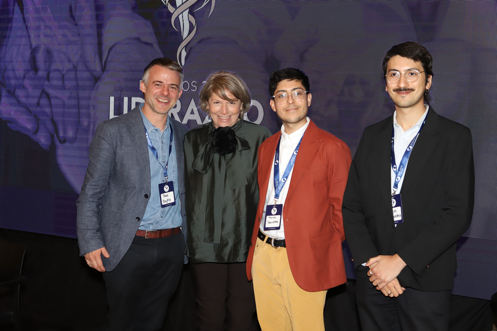
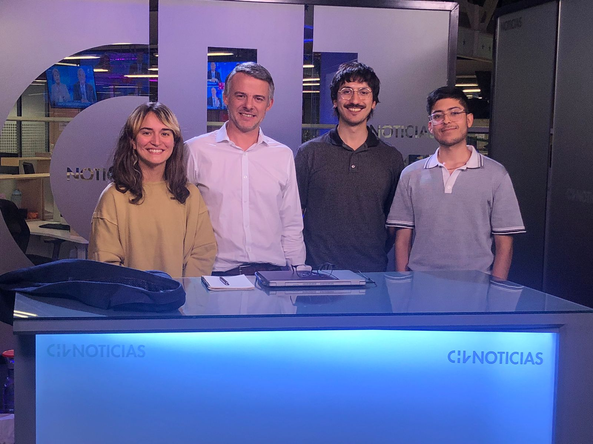

# Collaborations

  

    
  

  

    <h3 class="publication-title">
      <a href="https://www.observatoriodelcancer.cl/liderazgomujerycancer2026" class="publication-link" target="_blank" rel="noopener">Cáncer y mujeres en Chile. Radiografía digital de actores, temas y conversaciones</a>
    </h3>
    
2026

    

      Study mapping the digital landscape around cancer and women in Chile — identifying key actors, recurring topics, and the structure of online conversations across platforms.
    

    

      

        <a href="https://www.observatoriodelcancer.cl/liderazgomujerycancer2026" class="tag tag-github" target="_blank" rel="noopener">STUDY</a>
        <a href="https://www.youtube.com/watch?v=87w-FH3Bhqk&t=4257s" class="tag tag-notebook" target="_blank" rel="noopener">VIDEO</a>
      

    

  

  

    
  

  

    <h3 class="publication-title">
      <a href="https://www.monitorsocial.cl/debate" class="publication-link" target="_blank" rel="noopener">Monitor Social — Debate Electoral</a>
    </h3>
    
2025

    

      The project tracked real-time public attention toward the 2025 Chilean presidential candidates by collecting and analyzing large-scale digital trace data and producing findings published in CIPER and broadcast tools used on Chilevisión.
    

    

      

        <a href="https://www.monitorsocial.cl/debate" class="tag tag-github" target="_blank" rel="noopener">STUDY</a>
        <a href="https://www.latercera.com/nacional/noticia/edad-estatura-o-de-que-partido-es-las-busquedas-en-google-sobre-los-candidatos-durante-el-debate-y-quien-domino-en-rrss/" class="tag tag-notebook" target="_blank" rel="noopener">PRESS</a>
        <a href="https://www.ciperchile.cl/2025/09/05/candidatos-presidenciales-en-la-maquina-de-atencion-digital-cuanto-interes-estan-generando-en-internet/" class="tag tag-data" target="_blank" rel="noopener">COLUMN</a>
      

    

  

<!-- placeholder

  

    
  

  

    <h3 class="publication-title">
      <a href="#" class="publication-link">Partner / Project Name</a>
    </h3>
    
Your Role · Year

    

      Brief description of what you worked on together.
    

    

      

        <a href="#" class="tag tag-notebook" target="_blank" rel="noopener">ARTICLE</a>
      

    

  

-->

